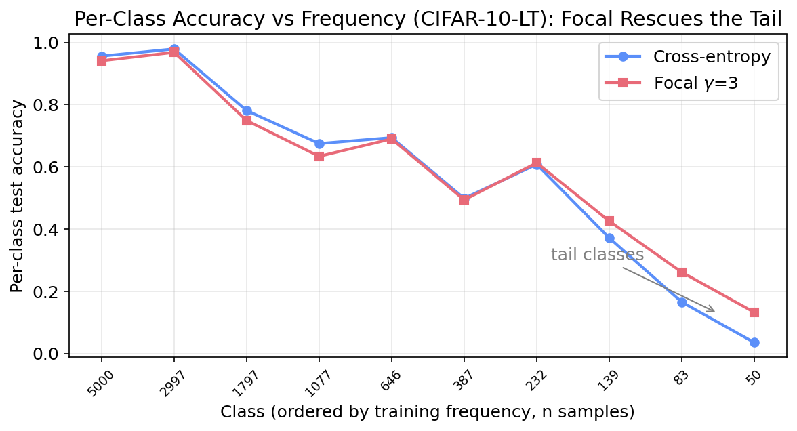

# When Does Focal Loss Help? Focal Loss vs Cross-Entropy on CIFAR-10 (Small CNN)

A controlled study answering a precise question: **does focal loss beat cross-entropy for
CIFAR-10 classification with a small CNN?** We hold a 0.31M-parameter CNN, optimizer, schedule,
and augmentation fixed and vary only the loss (cross-entropy vs focal loss, γ∈{1,2,3}) and the
class distribution (balanced CIFAR-10 vs long-tailed CIFAR-10-LT, imbalance 100).

📄 **Paper:** [paper/paper.pdf](paper/paper.pdf)
🌐 **Project page:** _(added after the website is deployed)_

## TL;DR
- **No** — on balanced CIFAR-10, **cross-entropy wins on accuracy (87.90%)**; focal loss never beats it and gets worse as γ grows. Focal loss only helps *calibration*, and only at γ=1 (ECE 0.0154 vs 0.0337).
- **Yes, under imbalance** — on long-tailed CIFAR-10-LT, **focal loss (γ=3) wins on every metric**: accuracy 59.1% vs 57.7%, macro-F1 +3.2pts, **worst-class accuracy 3.6% → 13.3% (3.7×)**, ECE 0.220 → 0.050 (4.4×).
- Focal loss is a tool for **imbalance and calibration**, not a generic accuracy upgrade.

## Results

### Balanced CIFAR-10
| Loss | Accuracy | ECE | Macro-F1 | Worst-class |
|------|----------|-----|----------|-------------|
| **Cross-entropy** | **0.8790** | 0.0337 | **0.8786** | 0.729 |
| Focal γ=1 | 0.8744 | **0.0154** | 0.8741 | 0.743 |
| Focal γ=2 | 0.8728 | 0.0660 | 0.8724 | 0.715 |
| Focal γ=3 | 0.8638 | 0.1096 | 0.8632 | 0.692 |

### Long-Tailed CIFAR-10-LT (imbalance 100)
| Loss | Accuracy | ECE | Macro-F1 | Worst-class |
|------|----------|-----|----------|-------------|
| Cross-entropy | 0.5766 | 0.2202 | 0.5332 | 0.036 |
| Focal γ=2 | 0.5908 | 0.0967 | 0.5618 | 0.114 |
| **Focal γ=3** | **0.5910** | **0.0503** | **0.5655** | **0.133** |



## Reproduce
Experiments run on [Modal](https://modal.com) serverless A100 GPUs (~20 min total).
```bash
pip install modal && modal setup
# one config per experiment (see experiments/modal/configs/)
modal run experiments/modal/modal_app.py --config-json "@experiments/modal/configs/exp01.json"
```
Then regenerate the data figures:
```bash
python paper/figures/make_plots.py
```

## Repository layout
- `paper/` — LaTeX source (`paper.tex`), compiled `paper.pdf`, figures, plotting script
- `experiments/` — Modal training script (`modal_app.py`), per-experiment configs, `results.jsonl` ledger, `experiments_log.md`
- `plan/experiment_plan.md` — the experiment design and success criteria
- `literature/literature_review.md` — the literature review
- `STATUS.md` — pipeline status and key decisions

## Citation
```bibtex
@misc{dwivedi2026focal,
  title  = {When Does Focal Loss Help? A Controlled Comparison of Focal Loss and
            Cross-Entropy for Small-CNN Image Classification on Balanced and
            Long-Tailed CIFAR-10},
  author = {Dwivedi, Naman and Dandekar, Raj and Dandekar, Rajat and Panat, Sreedath},
  year   = {2026},
  note   = {Vizuara AI Labs}
}
```

---
_Produced autonomously by the Vizuara research pipeline (literature review → planning →
Modal experiments → figures → paper → publication)._
